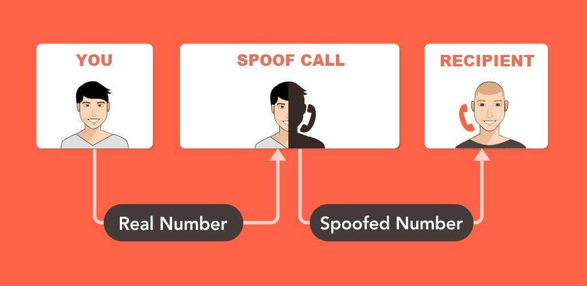

# spoofMe

**spoofMe** se trata de un programa construido en el lenguaje de programación _Python_, ideal para el Spoofing de llamadas y de mensajería instantánea (SMS).

Para el correcto funcionamiento del programa, es necesario contar con una cuenta del servicio https://www.spoofcard.com/, así como tener créditos registrados, pues en caso contrario el procedimiento no se efectuará correctamente.

Actualmente, la herramienta cuenta con las siguientes utilidades:

* Spoofing de Mensajería Instantánea (SMS)
* Spoofing de Llamadas Telefónicas

Mejoras a incorporar:

* Gestión de llamadas telefónicas desde terminal.
